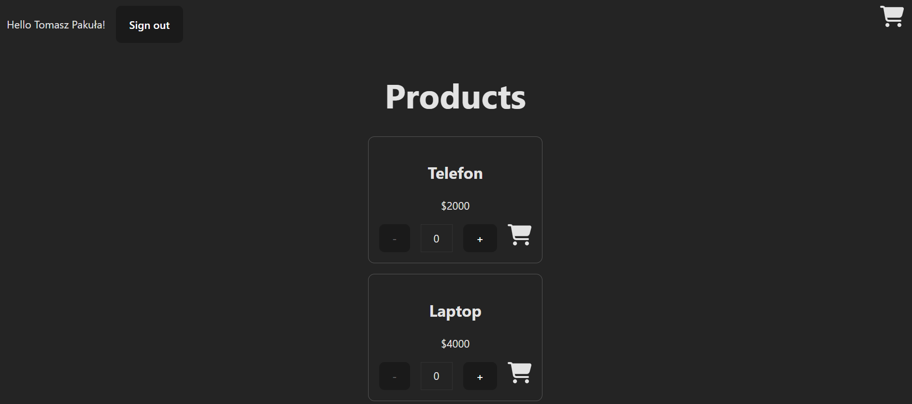
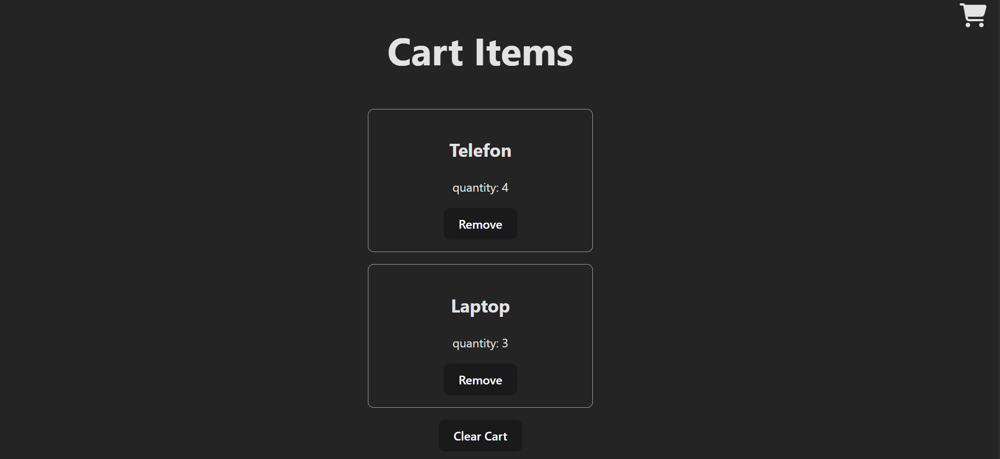
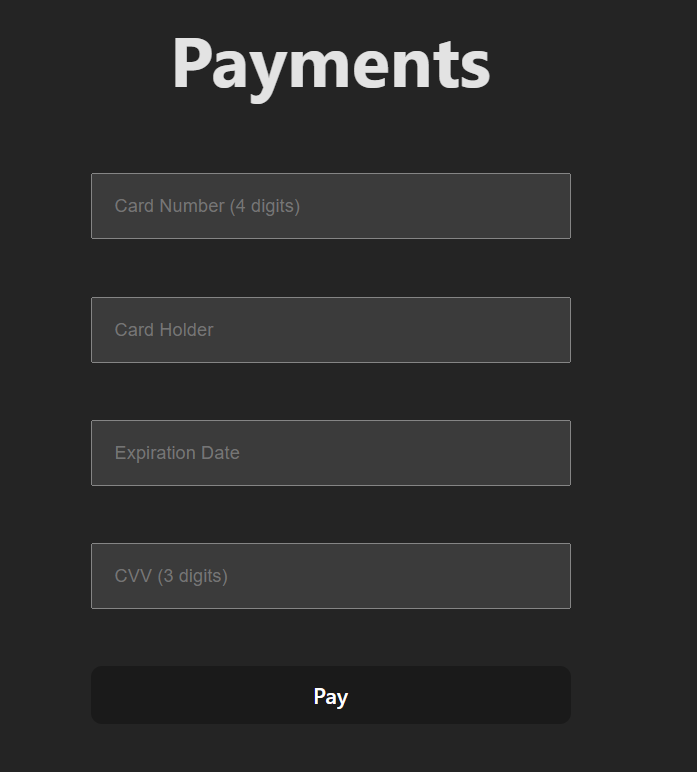
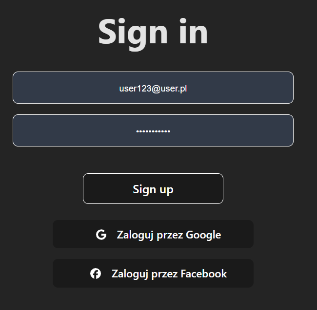

# **ShopApp**

## **Go**
```
go run main.go
```


## **React**
```
npm install
npm run dev
```

## **Functionality**

✅ Products view with an ability to add to cart

✅ Cart view with removing items, clearing cart, and going to pay

✅ Mocked Payments

✅ Sign in and sign up via form and Google, Facebook Oauth2

## **Tests**

✅ 30+ testcases with 100+ assertions in **Selenium**

✅ Unit tests with 100+ assertions in **Vitest**

✅ API tests in **Cypress**

✅ **Selenium** tests runned on **Browserstack**

## **Demo**









